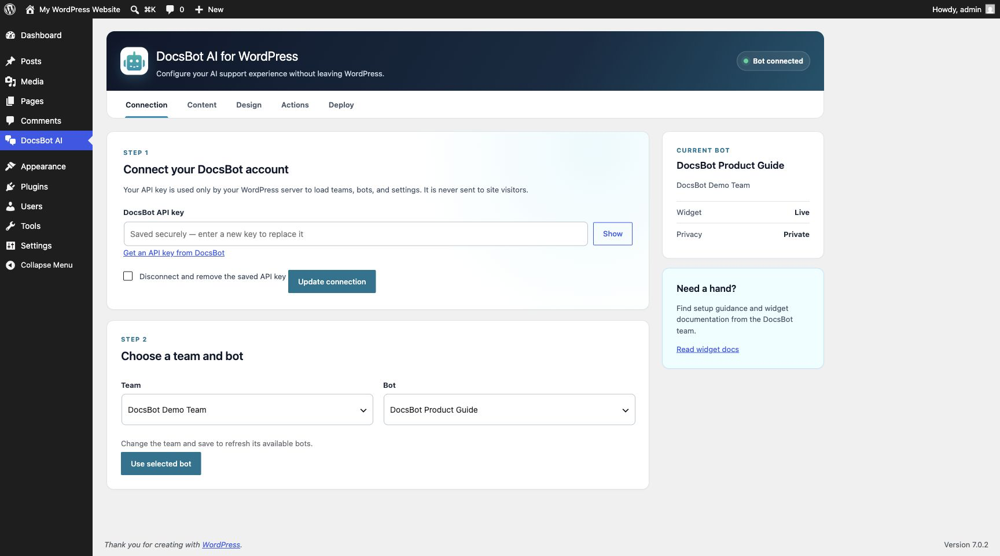
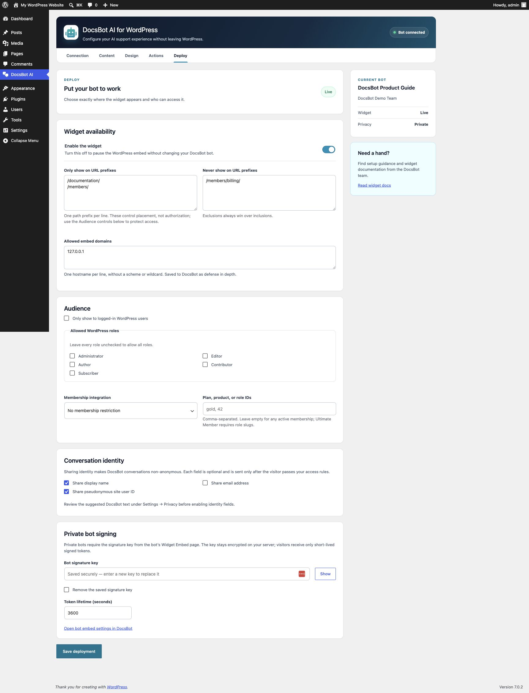

# DocsBot for WordPress

Bring your DocsBot support agent into WordPress with a polished, native settings experience.

The plugin connects to the DocsBot Admin API from your WordPress server, lets an administrator select an accessible team and bot, edits the bot’s core widget content and design, and controls exactly where the widget appears.

## Highlights

- Server-side team and bot discovery
- Native Content, Design, Actions, and Deploy settings
- Literal URL-prefix inclusion and exclusion rules
- Logged-in user and WordPress role restrictions
- Membership-aware access for WooCommerce Memberships, MemberPress, Paid Memberships Pro, Restrict Content Pro, WP-Members, and Ultimate Member roles
- Separate controls for display name, email, and the raw WordPress user ID
- Private bot support with short-lived HS256 JWTs
- Cache-safe runtime configuration: identity and signatures are never placed in cached page HTML
- No dashboard nags or sitewide notices

## Admin experience





## Requirements

- WordPress 6.5 or newer
- PHP 7.4 or newer
- A DocsBot account and user API key

## Languages

DocsBot is fully internationalized for community translation through [translate.wordpress.org](https://translate.wordpress.org/).

Import-ready catalogs for the WordPress.org listing are maintained in [`translations/wordpress-org`](translations/wordpress-org). They are translation drafts and must be reviewed by native speakers through the WordPress.org translation process before publication. Runtime translation files are intentionally excluded from the installable plugin because WordPress.org generates and distributes language packs.

## WordPress.org assets

The repository includes the complete directory artwork in [`.wordpress-org`](.wordpress-org): standard and Retina banners, subtly animated PNG icons, and five screenshots. These files are intentionally kept outside the installable plugin ZIP, as required by the WordPress.org plugin asset layout.

## Publishing to WordPress.org

The release workflow validates and packages every release before publication. Configure the GitHub Actions repository secrets `SVN_USERNAME` and `SVN_PASSWORD` with the case-sensitive WordPress.org SVN username and the separate SVN password from the WordPress.org profile.

For normal releases, update the plugin header version, `DOCSBOT_VERSION`, and the `Stable tag` in `docsbot/readme.txt`, then push the matching `vX.Y.Z` Git tag. A validated tag automatically publishes `docsbot/` to SVN trunk and the `X.Y.Z` SVN tag, while `.wordpress-org/` is synchronized to the SVN assets directory.

The workflow's manual **Publish to WordPress.org SVN** option supports an approved version whose Git tag predates the deployment workflow. It publishes the checked-out branch only after the same validation, metadata, and packaging checks pass.

## Installation

1. Download the release ZIP.
2. In WordPress, go to **Plugins → Add New Plugin → Upload Plugin**.
3. Activate **DocsBot**.
4. Open **Settings → DocsBot → Connection**.
5. Create or copy your key from the [DocsBot API Keys page](https://docsbot.ai/app/api). DocsBot selects your current accessible team when available, then you choose a bot.
6. Configure the widget and enable it from the Deploy tab.

For private bots, the plugin retrieves the signing key with the authorized bot response and encrypts it immediately. There is no signing-key field in WordPress.

## Security model

The DocsBot user API key and private-bot signing key are encrypted with WordPress's bundled Sodium compatibility layer using authenticated `secretbox` encryption, installation-specific WordPress salts, and a fresh random nonce. Credentials are stored in a non-autoloaded option. High-security installations can set `DOCSBOT_API_KEY` and `DOCSBOT_SIGNATURE_KEY` in `wp-config.php` instead.

The API key never reaches browser JavaScript. For private bots, WordPress checks page, login, role, and membership rules before issuing a token. The browser receives a short-lived JWT—not the signing key—through a no-store REST response.

URL path rules are placement controls, not an authorization boundary. Sites that need protected chat must also enable a server-verified login, WordPress role, or membership restriction.

Identity sharing is enabled by default for new plugin setups. Site owners can independently turn off sending the logged-in visitor's display name, email address, and raw WordPress user ID. The plugin never sends membership, role, payment, password, or subscription data to DocsBot.

For private bots, signed JWTs for logged-in visitors include the current WordPress user ID as trusted `priv_user_id` metadata. Guest JWTs do not include a user ID. DocsBot keeps `priv_*` metadata out of chat history and AI model context while making it available to authorized integrations.

## External services

This plugin connects to DocsBot, a third-party SaaS:

- `https://docsbot.ai/api` is called from the WordPress server when an administrator connects an account, reads the authenticated user's current team, lists teams or bots, reads a bot, or saves supported bot settings.
- `https://widget.docsbot.ai/chat.js` is loaded for eligible site visitors when the widget is enabled.
- The DocsBot chat service processes visitor messages and any identity fields explicitly enabled by the administrator.

Review the [DocsBot Privacy Policy](https://docsbot.ai/privacy), [Terms of Service](https://docsbot.ai/terms), and [widget documentation](https://docsbot.ai/documentation/developer/embeddable-chat-widget).

## Development

Install checks:

```bash
composer install
composer check
```

Run a lightweight WordPress Playground site:

```bash
npx @wp-playground/cli@latest start \
  --path=./docsbot \
  --wp=latest \
  --php=8.3 \
  --port=9400 \
  --skip-browser \
  --reset
```

The production plugin has no Composer or Node runtime dependencies.

## License

GPL-2.0-or-later.
